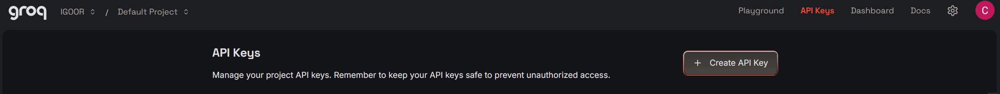
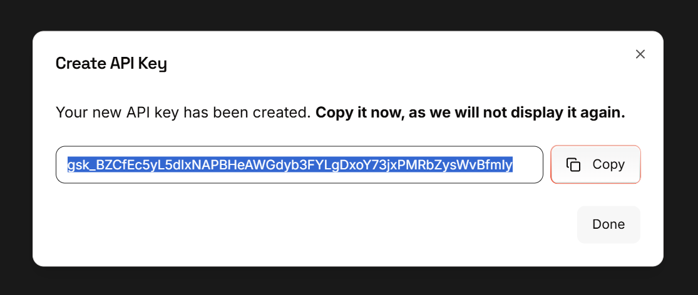

Pour utiliser les prédictions d'IGOOR, vous avez besoin d'une clé de l'API du fournisseur IA Groq.

[Obtenir une :key: Groq](https://console.groq.com/keys){ .md-button target=_blank}

**IMPORTANT : Nous ne sommes ni partenaires ni affiliés de Groq. D'autres fournisseurs pourront être ajoutés par la suite.**

 Aujourd'hui, nous utilisons les modèles proposés par le fournisseur Groq pour les avantages suivants :

- Vitesse ([Groq est un constructeur de chips dédiés](https://groq.com/lpu-architecture))
- [Respect de la vie privée](https://groq.com/privacy-policy/) (ses serveurs sont en Europe)
- Groq n'utilise pas les données pour entrainer ses modèles, parce qu'il [supporte des modèles open-source et open-weights](https://console.groq.com/docs/models)
- [Un modèle de prix extremement concurrentiel](https://groq.com/pricing )

#### Tester Groq gratuitement avec un compte développeur

Groq vous permet de tester gratuitement ses fonctionnalités avec un compte développeur.

[Obtenez une clé gratuite Groq](https://console.groq.com/keys) 

Inscrivez-vous à l'aide de votre adresse email (si vous avez un compte Google ou d'un des autres fournisseurs indiqués, vous pouvez vous authentifier à travers eux).

Une fois authentifié, cliquez sur le bouton *Create API Key* :

Donnez un nom à votre clé dans la fenetre qui s'ouvre, par ex. "igoorclé" :

Dans la fenetre qui s'ouvre, copiez votre clé en cliquant sur le bouton *Copy* :

Revenez dans le logiciel IGOOR, rentres dans les paramètres (bouton en haut à droite) et cliquez sur l'onglet IA. 

Collez la clé dans le champ Clé API et cliquez sur le bouton **Enregistrer les paramètres principaux** :

La fenêtre des paramètres se ferme automatiquement. 

**IMPORTANT: Si vous utilisez régulièrement IGOOR vous allez rapidement rencontrer des limitations (et donc les prédictions peuvent ne pas fonctionner pendant un certain temps). Pensez à renseigner vos informations de carte bancaire sur Groq pour avoir un compte pro.**

[Suivre votre consommation sur la dashboard Groq :dollar:](https://console.groq.com/dashboard/usage){ .md-button target=_blank}