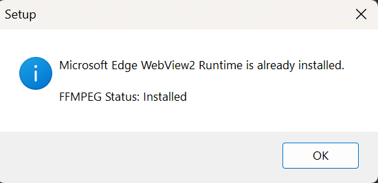
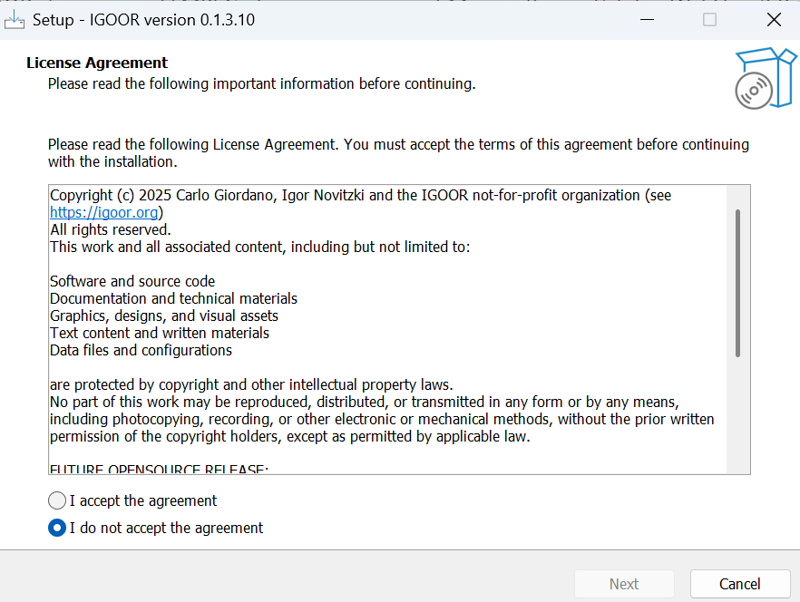
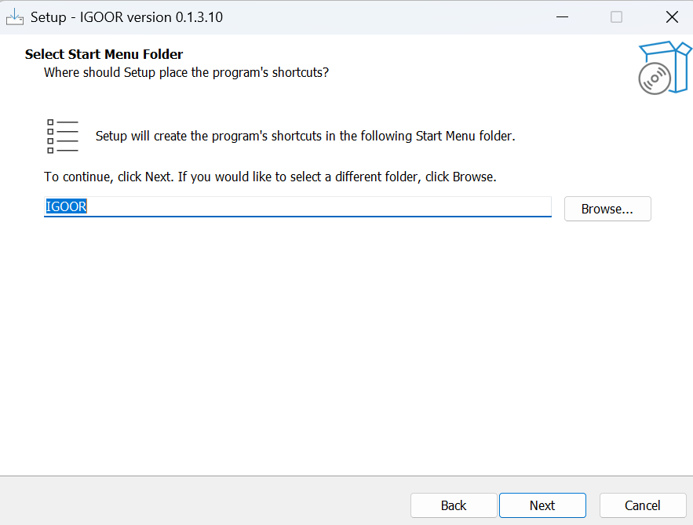
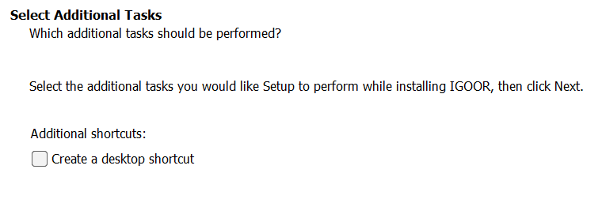
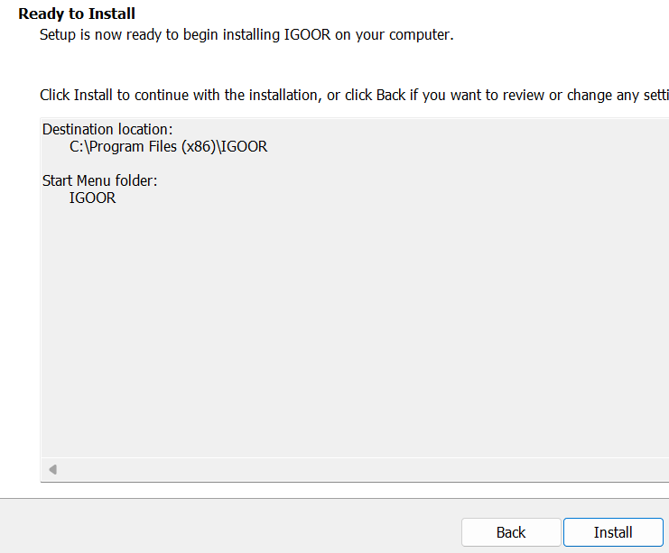

Click on the installer and allow installation from an unknown source

### Installation of third-party components

IGOOR relies on FFMPEG and a Microsoft component called Edge WebView2 Runtime.
If they are already installed on your computer, you will see this box:

Otherwise, the installer will continue to install them on your machine.
Follow the instructions for their installation.

### License

You must then accept the IGOOR license:

Next, choose the folder where to install IGOOR if you want (or leave the default folder).
You can then choose where the software will appear in the Windows Start menu:

Then check the box to create a shortcut on the desktop:

The summary prompts you to finalize the installation by clicking on "Install":

The software starts the installation:

At the end of the installation, you can directly run IGOOR by clicking on its shortcut on the desktop (if you created it) or from the programs menu.

Continue to your [[4 - First run]]

**IMPORTANT: If you're running into issues installing, check [[Troubleshooting common problems]]**
