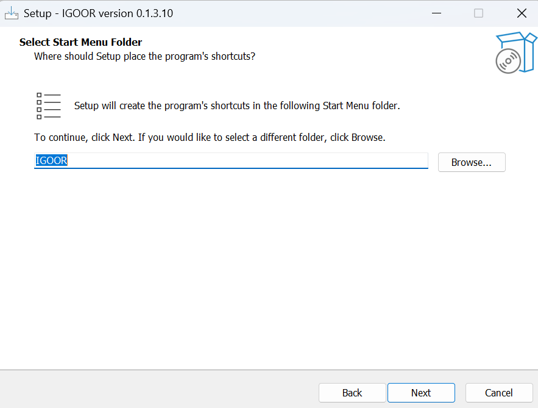
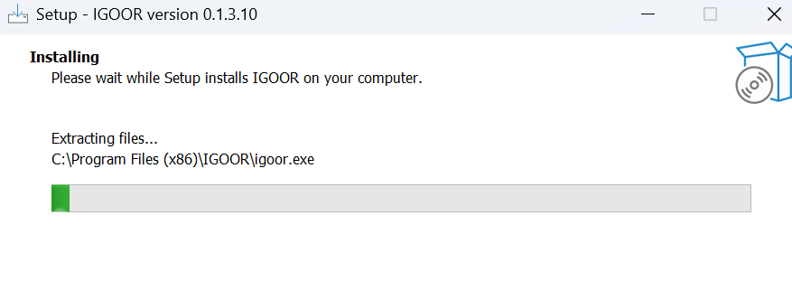

Click on the installer and allow installation from an unknown source

### Installation of third-party components

IGOOR relies on FFMPEG and a Microsoft component called Edge WebView2 Runtime.
If they are already installed on your computer, you will see this box:

Otherwise, the installer will continue their installation on your machine.
Follow the instructions for their installation.

### License

You must then accept the IGOOR license:

Next, choose the folder where to install IGOOR if desired (or leave the default folder).
You can then specify where the software will appear in the Windows Start menu:

Next, check the box to create a desktop shortcut:

The summary prompts you to finalize the installation by clicking "Install":

The software begins installation:

At the end of the installation, you can directly launch IGOOR.

## Common installation troubleshooting

1. The IGOOR association is not registered with Microsoft as a software publisher. SmartScreen may therefore prevent you from starting the installation process entirely and display this popup:

**SOLUTION: Click on "Additional information" and then "Run anyway"**

2. At the end of the installation process, the application launch may fail due to a false positive. A popup opens informing you that the application has been identified as a virus.

**SOLUTION: Run the software installation as administrator**