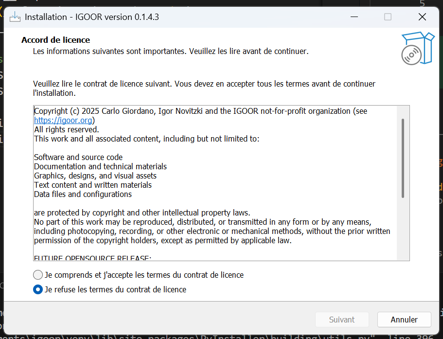

Click the installer and allow the installation from an unknown source.

### Third-party components installation

IGOOR relies on FFmpeg and on a Microsoft component called Edge WebView2 Runtime.
If they are already installed on your computer, you will see this box:

Otherwise, the installer will continue installing them on your machine.
Follow the instructions to install them.

### License

You then need to accept the IGOOR license:

Then, choose the folder where to install IGOOR if you wish (or leave the default folder).
You can then define where the software will appear in the Windows Start menu:

Next, check the boxes if you wish to:

a) create a desktop shortcut;
b) automatically launch IGOOR at Windows startup.

The summary invites you to finalize the installation by clicking "Install":

The software starts the installation:

At the end of the installation, you can launch IGOOR directly from its icon: go to [[5 - First run]].

**IMPORTANT: If you run into installation problems, follow [[Troubleshooting common problems]]**
