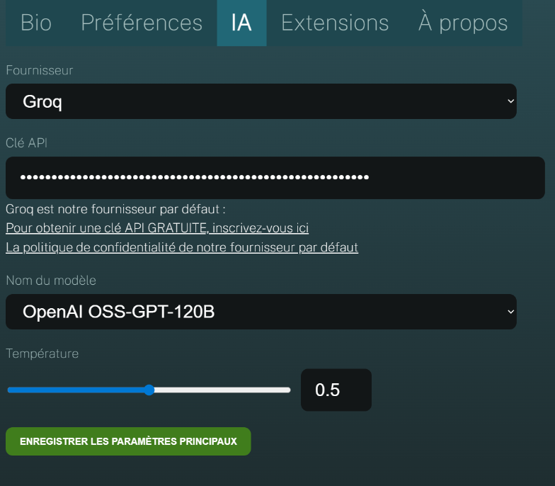

To use IGOOR predictions, you need an API key from the AI provider Groq.

[Get a :key: Groq API key](https://console.groq.com/keys){ .md-button target=_blank}

**IMPORTANT: We are neither partners nor affiliated with Groq. Other providers may be added in the future.**

Today, we use the models offered by the Groq provider for the following advantages:

- Speed ([Groq is a chip manufacturer](https://groq.com/lpu-architecture))
- [Privacy compliance](https://groq.com/privacy-policy/) (their servers are located in Europe)
- Groq does not use data to train its models, as it [supports open-source and open-weights models](https://console.groq.com/docs/models)
- [An extremely competitive pricing model](https://groq.com/pricing)

#### Test Groq for free with a developer account

Groq allows you to test its features for free with a developer account.

[Get a free Groq key](https://console.groq.com/keys)

Sign up using your email address (if you have a Google account or one of the other providers listed, you can authenticate through them).

Once authenticated, click on the *Create API Key* button:

Name your key in the window that opens, for example, "igoorclé":

In the window that opens, copy your key by clicking on the *Copy* button:

Go back to the IGOOR software, enter the settings (button in the top right corner) and click on the AI tab.

Paste the key into the API Key field and click on the **Save Main Settings** button:

The settings window will close automatically.

**IMPORTANT: If you use IGOOR regularly, you will quickly encounter limitations (and therefore predictions may not work for a certain period of time). Make sure to enter your credit card information on Groq to get a pro account.**

[Track your usage on the Groq dashboard :dollar:](https://console.groq.com/dashboard/usage){ .md-button target=_blank}