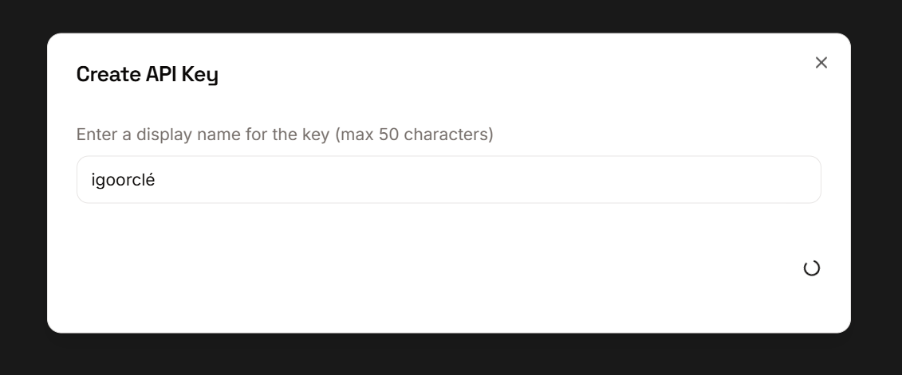
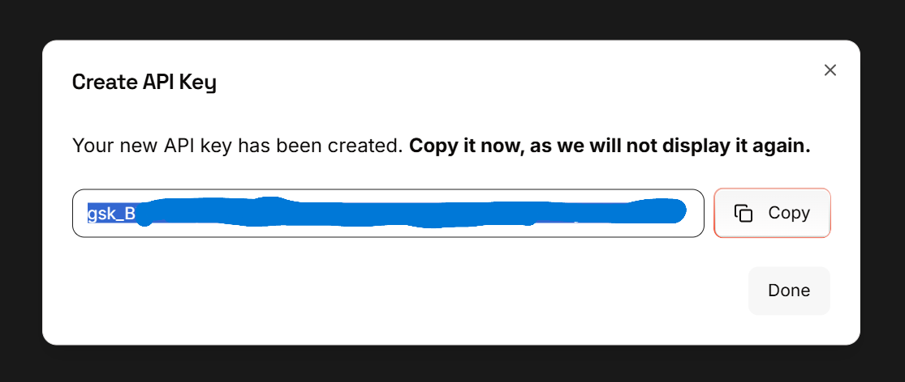
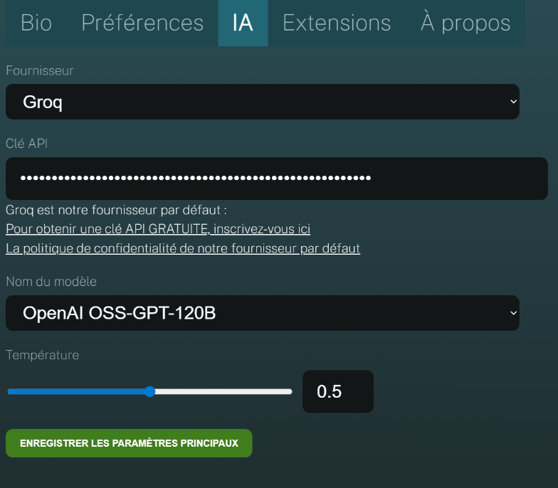

IGOOR is designed to allow many customizations. If you want to go in depth right away, go to [[1 - Home page]].

**If, on the other hand, you want to test IGOOR as quickly as possible, configure it through a free Groq key:**

We recommend the Groq provider for the following advantages:

- Speed ([Groq is a dedicated chip manufacturer](https://groq.com/lpu-architecture))
- [Respect for privacy](https://groq.com/privacy-policy/) (its servers are located in Europe)
- Groq does not use the data to train its models, because it [supports open-source and open-weights models](https://console.groq.com/docs/models)
- Groq also offers two good **voice recognition** models
- You can use their **free offer without needing to enter your payment information**, with no time limits  
- If you decide to switch to the paid version, Groq offers [an extremely competitive pricing model](https://groq.com/pricing )

**IMPORTANT: We are neither partners nor affiliated with Groq. From version 1 onwards, IGOOR supports other cloud AI providers ([[4 - Preferences - AI]]) as well as your local AI.**

### Use IGOOR for free with Groq

Groq lets you test its features for free with a developer account.

[Get a :key: Groq](https://console.groq.com/keys){ .md-button target=_blank}

Sign up using your email address (if you have a Google account or one of the other providers shown, you can authenticate through them).

Once authenticated, click the *Create API Key* button:

Give a name to your key in the window that opens, for example "igoorclé":

In the window that opens, copy your key by clicking the *Copy* button:

Go back to the IGOOR software, open the settings (button at the top right) and click the AI tab.

Paste the key into the API Key field and click the **Save main settings** button:

The settings window closes automatically.

**IMPORTANT: If you use IGOOR regularly, you may quickly run into limitations (and so predictions may be paused for a while). Consider entering your credit card information on Groq to get a paid developer account if you run into these issues.**

<a href="https://console.groq.com/docs/rate-limits" target="_blank">Check Groq's limitations on free / developer accounts.</a>

[Track your usage on the Groq dashboard :dollar:](https://console.groq.com/dashboard/usage){ .md-button target=_blank}
