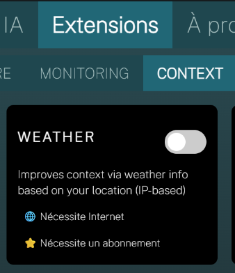
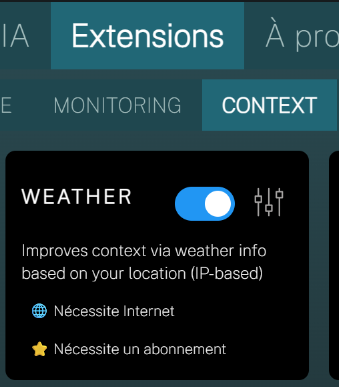
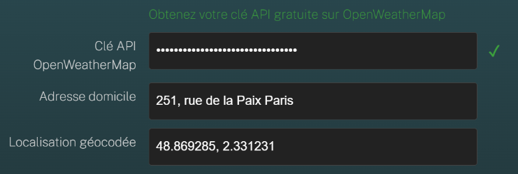
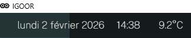

This extension adds contextual weather information (temperature, wind, etc.) to the context—the set of information sent to the AI to generate predictions (see [[1 - Four Communication Aid Tools]]).

**WARNING: To function, the service requires retrieving your current location every 10 minutes based on your Internet connection's IP address. The accuracy of the location may vary.**

## Extension Activation

Go to **Settings > Extensions > Context > Weather**:

Enable the toggle.  
✅ **IMPORTANT: You must restart IGOOR when activating (or deactivating) extensions.**

## Extension Configuration

Go to **Settings > Extensions > Context > Weather**:

Click the extension's settings icon. The extension uses a free service from [OpenWeatherMap](https://openweathermap.org/).

- Register and retrieve your API key here:  
    [Get a free OpenWeatherMap API key](https://home.openweathermap.org/users/sign_up){target:blank}

- You can enter your exact home address. **This address is never shared externally; it's used internally by IGOOR to compare against the automatically updated location, to determine if the user is at home.** What is sent to OpenWeatherMap is the geocoded latitude / longitude.

Save your changes.

## Verification

Once activated, you'll see the weather temperature in the top bar:

From this moment, weather information will be added to all text predictions.