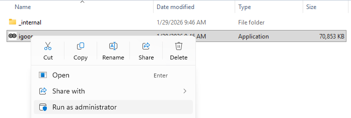

## Installation

### Smart Screen

IGOOR’s association is not yet certified as a software publisher. SmartScreen may therefore prevent you from starting the installation process at all and display this popup:

![[../assets/smartscreen.webp]]
**SOLUTION:** Click “More information” and then “Run anyway”.

### Antivirus

At the end of the installation process, the application may fail to launch because of a false positive virus detection by Windows or your antivirus. A popup opens and informs you that the application has been recognized as a virus.

**SOLUTION:** Run the software installation as an administrator by right‑clicking the application’s icon and selecting “Run as administrator” in the context menu that appears.

---

## Using the application

### Poor display in the application

If your daily‑needs screen looks like this:

![[../assets/bug_windows_font_size.png]]

It is most likely caused by Windows automatically resizing the text.

**Fix on Windows:**

1. Go to **Start > Settings > System > Display**.
2. Scroll down to the **Scale & layout** section.
3. If the percentage is above **100 %–150 %**, set it to **100 %** and restart IGOOR; the display should now be perfect.