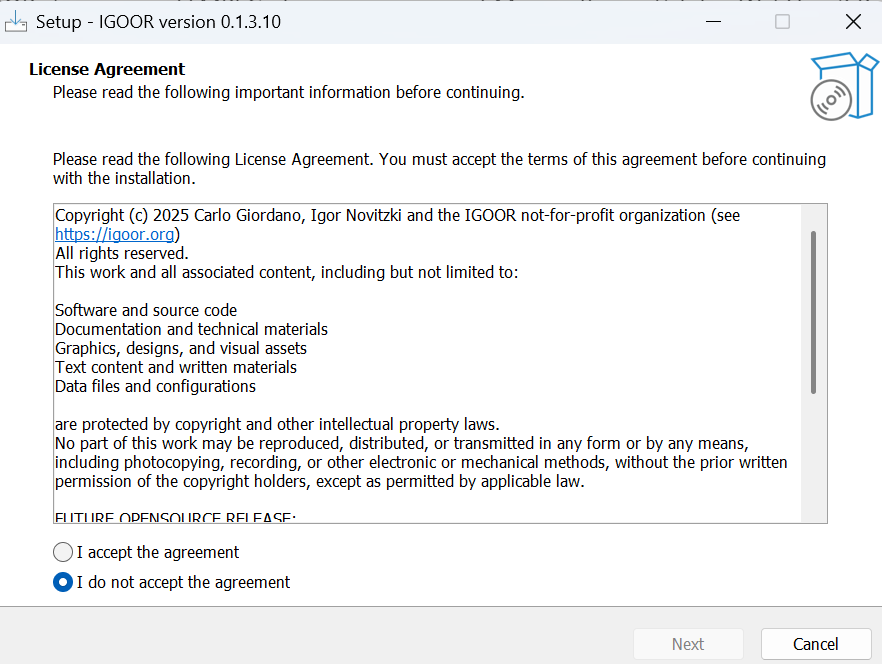

Cliquez sur l'installeur et autorisez l'installation depuis une source inconnue

### Installation composants tierces

IGOOR s'appuie sur FFMPEG et sur un composant Microsoft appelé Edge WebView2 Runtime.
S'ils sont déjà installés sur votre ordinateurs, vous verrez ce box :

Autrement, le programme d'installation va continuer leur installation sur votre machine.
Suivez les instructions pour leur installation.

### License

Vous devez ensuite accepter la licence IGOOR :

Ensuite, choisissez le dossier où installer IGOOR si vous le souhaitez (ou laissez le dossier par défaut).
Vous pouvez ensuite definir où se situera le logiciel dans le menu Start de Windows :

Ensuite cochez la case pour créer un raccourci sur le bureau :

Le recapitulatif vous invite à finalisers l'installation en cliquant sur "Install" :

Le logiciel commence l'installation :

A la fin de l'installation, vous pourrez directement démarrer IGOOR.

## Résolution de problèmes d'installation communs

1. L'association IGOOR n'est pas enregistré auprès de Microsoft en tant qu'éditeur de logiciel. SmartScreen peut donc ne pas vous laisser initier du tout le processus d'installation et vous afficher ce popup :

**SOLUTION: Cliquer sur "Information complémentaires" et ensuite "Executer quand meme"

2. A la fin du processus d'installation, le lancement de l'application peut échouer à cause d'un faux positif. Un popup s'ouvre et vous informe que l'application a été reconnue comme étant un virus.

**SOLUTION: Executer en tant qu'administrateur l'installation du logiciel**