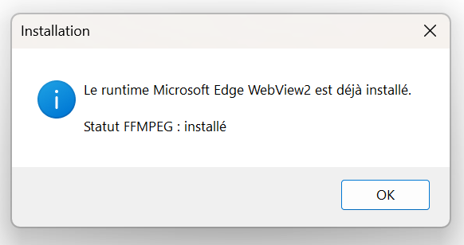
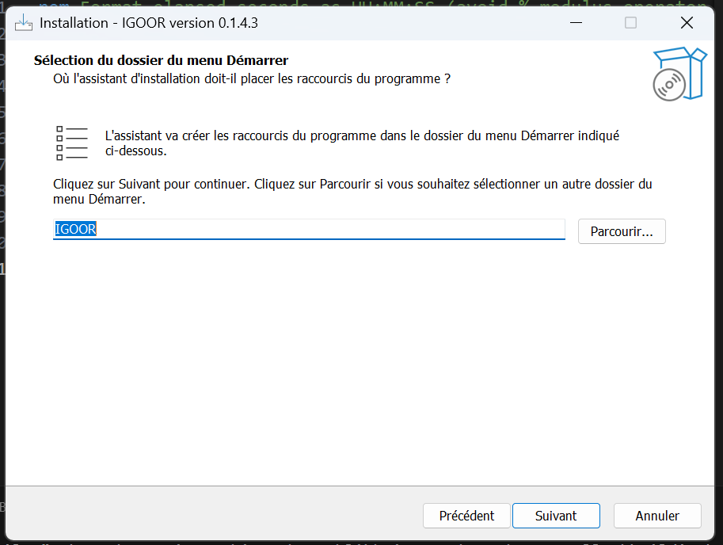
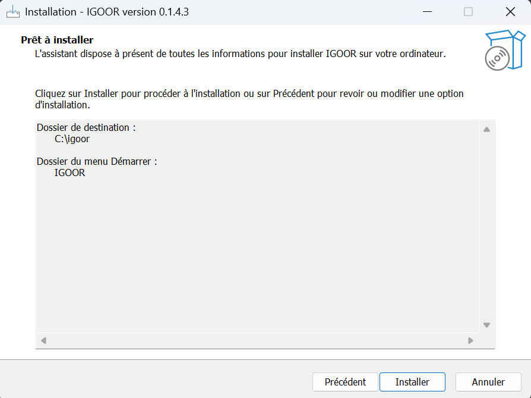
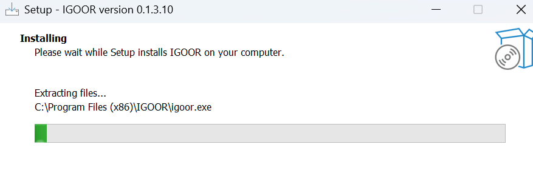

Cliquez sur l'installeur et autorisez l'installation depuis une source inconnue

### Installation composants tierces

IGOOR s'appuie sur FFMPEG et sur un composant Microsoft appelé Edge WebView2 Runtime.
S'ils sont déjà installés sur votre ordinateur, vous verrez ce box :

Autrement, le programme d'installation va continuer leur installation sur votre machine.
Suivez les instructions pour leur installation.

### License

Vous devez ensuite accepter la licence IGOOR :

Ensuite, choisissez le dossier où installer IGOOR si vous le souhaitez (ou laissez le dossier par défaut).
Vous pouvez ensuite definir où se situera le logiciel dans le menu Start de Windows :

Ensuite, cochez les cases si vous souhaitez :

a) créer un raccourci sur le bureau ;
b) lancer automatiquement IGOOR au démarrage de Windows.

Le recapitulatif vous invite à finalisers l'installation en cliquant sur "Install" :

Le logiciel commence l'installation :

A la fin de l'installation, vous pourrez directement démarrer IGOOR depuis son icône : allez au [[4 - Premier lancement]].

**IMPORTANT: Si vous rencontrez des problèmes d'installation : suivez [[RESOLUTION DES PROBLEMS COMMUNS]]**
