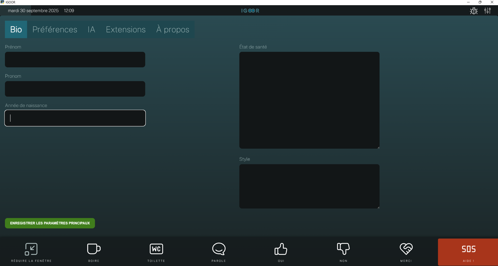

## Paramètres obligatoires

La première fois que vous ouvrez IGOOR, la page des paramétrages s'ouvre automatiquement :

Les champs obligatoires sont le prénom, l'état de sante et, dans les [[2 - Préférences - IA]], la clé Groq. 

### L'état de santé 

L'état de santé est un champ crucial parce qu'il contraint systématiquement les prédictions fournies par l'I.A. sur la base des capacités physiques de l'utilisateur. Si ces dispositions évoluent sensiblement, il est bien de le mettre à jour même si la mémoire de IGOOR pourrait contenir déjà ces informations.

<video src="https://igoor.org/wp-content/uploads/2025/09/IGOOR-mettre-a-jour-etat-de-sante.mp4" controls></video>

### Le style

Vous pouvez renseigner dans ce champ des indications sur le style de vos phrases, qui peuvent changer profondément le style des prédictions générées par IGOOR. Ex. :

"Elle s'exprime avec des phrases longues, avec plein de citations philosophiques"

donnera de très différentes prédictions de :

"Elle aime utiliser des  phrases courtes, concises, avec un ton très informel".

