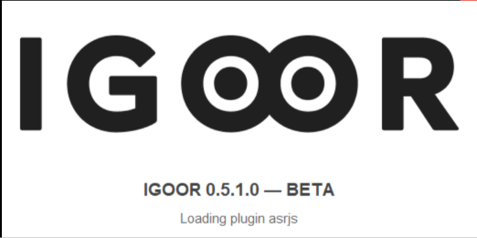

La versione di IGOOR viene visualizzata quando avviate il software:

(in questo caso, è la 0.5.1.0)

### 1) Copiate i dati

Per prima cosa, chiudete il software IGOOR (se lo state utilizzando).
Localizzate poi la cartella che contiene tutti i vostri dati IGOOR. 
Si trova all'interno della cartella:
   
   `C:\Utenti\nome-utente-windows\AppData\Roaming`
   
Ad esempio, se il vostro nome utente Windows è "jean", la cartella si troverà in:
   
   `C:\Utenti\jean\AppData\Roaming`
   
Vedrete una cartella denominata "igoor". Copiatela o rinominatela.
   
Quindi avviate IGOOR.
Se usate il riconoscimento vocale tramite VOSK, andate in:

*Parametri > Estensioni > ASR*

E disattivate l'estensione Vosk. Vosk è stato sostituito da un altro modello che potrete attivare in seguito tramite [[3 - Riconoscimento vocale in locale]].

Andate poi in:

*Parametri > Home* 

E cliccate sul pulsante *Esporta i dati*. I dati vengono esportati in formato .zip nella vostra cartella *Download*.

### 2) Disinstallate la versione attuale

Chiudete IGOOR e disinstallatelo come qualsiasi altra applicazione Windows.

### 3) Installate la nuova versione di IGOOR

[Scaricate l'ultima versione disponibile di IGOOR :material-download:](https://bit.ly/4t7R78U){ .md-button target=_blank }

Avviate l'installazione come avete già fatto in precedenza (vedi [[4 - Installare IGOOR]]).
Potete installare IGOOR nella stessa cartella (nessun problema se ricevete un avviso che la cartella non è vuota).

### 4) Importate i dati

Andate in:

*Parametri > Importa i dati* 

E selezionate il file zip nella vostra cartella *Download*.
Questa operazione importerà la vostra bio, le vostre estensioni, le preferenze, ecc. 

Se incontrate problemi durante l'aggiornamento, 
vi preghiamo di contattare support@igoor.org e vi risponderemo nel più breve tempo possibile.

