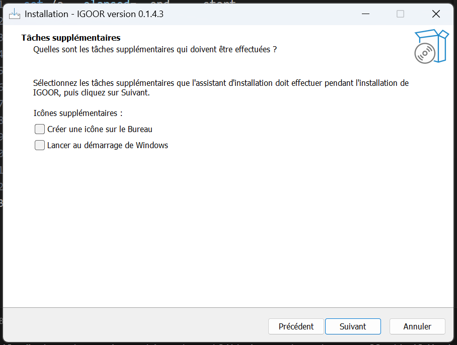

Cliccate sull'installer e autorizzate l'installazione da un'origine sconosciuta.

### Installazione dei componenti di terze parti

IGOOR si basa su FFMPEG e su un componente Microsoft denominato Edge WebView2 Runtime.
Se sono già installati sul vostro computer, vedrete questa finestra:

In caso contrario, il programma di installazione proseguirà con la loro installazione sul vostro computer.
Seguite le istruzioni per l'installazione.

### Licenza

Dovete quindi accettare la licenza IGOOR:

Quindi scegliete la cartella in cui installare IGOOR se lo desiderate (oppure lasciate la cartella predefinita).
Potete in seguito definire dove verrà collocato il software nel menu Start di Windows:

Quindi, selezionate le caselle se desiderate:

a) creare un collegamento sul desktop;
b) avviare automaticamente IGOOR all'avvio di Windows.

Il riepilogo vi invita a finalizzare l'installazione cliccando su "Install":

Il software inizia l'installazione:

Al termine dell'installazione, potrete avviare direttamente IGOOR dalla sua icona: andate al [[5 - Primo avvio]].

**IMPORTANTE: Se incontrate problemi di installazione: seguite [[RISOLUZIONE DEI PROBLEMI COMUNI]]**
