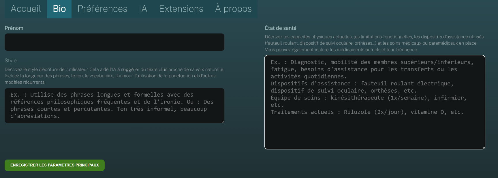

## Parametri obbligatori

La prima volta che aprite IGOOR, la pagina della *Biografia* dell'utente si apre automaticamente :

I campi obbligatori sono il nome, lo stato di salute e la chiave del fornitore di IA (vedi  [[2 - Configurazione rapida]]).

### Lo stato di salute

**Lo stato di salute è un campo cruciale perché vincola sistematicamente le previsioni fornite dall'I.A. sulla base delle capacità fisiche dell'utente**.

![[health_state_2.png]]

Ecco un esempio :

> Julie vive con una Sclerosi Laterale Amiotrofica (SLA) che ha comportato una diminuzione progressiva della sua autonomia motoria. Presenta oggi una perdita di mobilità importante degli arti inferiori, che richiede l'uso permanente di una sedia a rotelle elettrica per tutti i suoi spostamenti. Anche gli arti superiori sono interessati, il che limita la forza e la precisione nei gesti quotidiani. Avverte una rapida fatica muscolare e ha bisogno di assistenza per i trasferimenti e per alcune attività della vita quotidiana.
>
> Julie beneficia di un accompagnamento pluridisciplinare regolare, che comprende una fisioterapista (una seduta a settimana), una sophrologa, un'infermiera psichiatrica e un osteopata, che costituiscono una rete di sostegno indispensabile.

**SUGGERIMENTO : Se lo stato di salute e le capacità fisiche dell'utente evolvono sensibilmente, è bene aggiornare manualmente lo stato di salute, anche se la memoria di IGOOR potrebbe già contenere queste informazioni.**

Terminate la [[2 - Configurazione rapida]]
