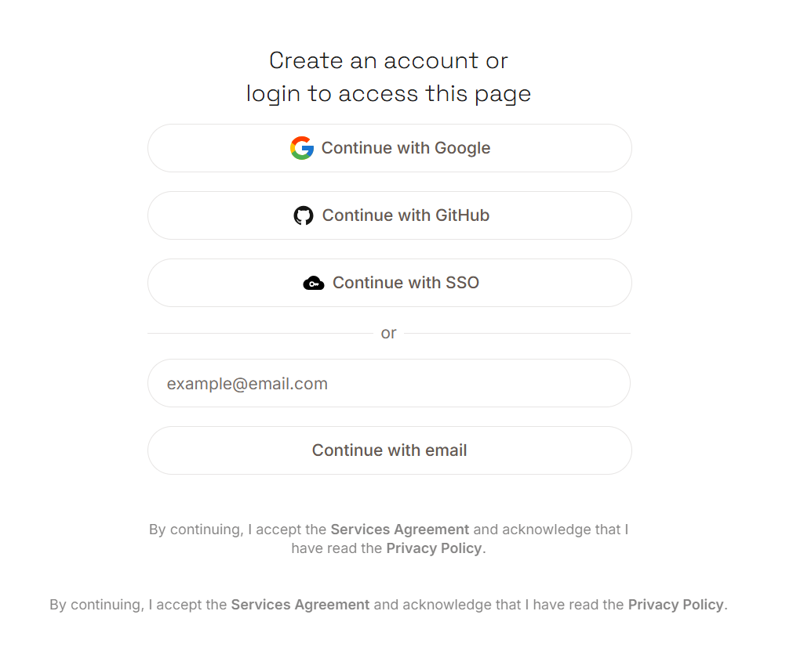
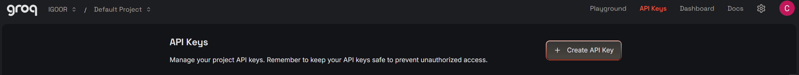

IGOOR è progettato per consentire molte personalizzazioni. Se desiderate approfondire subito, andate su [[1 - Pagina home]].

**Se invece desiderate testare IGOOR il più rapidamente possibile, configuratelo attraverso una chiave gratuita Groq :**

Consigliamo il fornitore Groq per i seguenti vantaggi :

- Velocità ([Groq è un costruttore di chip dedicati](https://groq.com/lpu-architecture))
- [Rispetto della vita privata](https://groq.com/privacy-policy/) (i suoi server si trovano in Europa)
- Groq non utilizza i dati per addestrare i propri modelli, perché [supporta modelli open-source e open-weights](https://console.groq.com/docs/models)
- Groq offre anche due buoni modelli di **riconoscimento vocale**
- Potete utilizzare la loro **offerta gratuita senza dover inserire i vostri dati di pagamento**, e ciò senza limiti di tempo  
- Se decidete di passare alla versione a pagamento, Groq propone [un modello di prezzi estremamente competitivo](https://groq.com/pricing )

**IMPORTANTE : Non siamo né partner né affiliati di Groq. A partire dalla versione 1, IGOOR supporta altri fornitori IA cloud ([[4 - Preferenze - IA]]) così come la vostra IA locale.**

### Usare IGOOR gratuitamente con Groq

Groq vi permette di testare gratuitamente le sue funzionalità con un account sviluppatore.

[Ottenere una :key: Groq](https://console.groq.com/keys){ .md-button target=_blank}

Iscrivetevi utilizzando il vostro indirizzo email (se avete un account Google o di uno degli altri fornitori indicati, potete autenticarvi attraverso di essi).

Una volta autenticati, cliccate sul pulsante *Create API Key* :

Date un nome alla vostra chiave nella finestra che si apre, ad es. "igoorclé" :

Nella finestra che si apre, copiate la vostra chiave cliccando sul pulsante *Copy* :

Tornate nel software IGOOR, entrate nei parametri (pulsante in alto a destra) e cliccate sulla scheda IA.

Incollate la chiave nel campo Chiave API e cliccate sul pulsante **Salva i parametri principali** :

La finestra dei parametri si chiude automaticamente.

**IMPORTANTE : Se utilizzate regolarmente IGOOR, potete incontrare rapidamente delle limitazioni (e quindi le previsioni possono essere messe in pausa per un certo periodo). Pensate a inserire le informazioni della vostra carta di pagamento su Groq per avere un account sviluppatore a pagamento se incontrate queste problematiche.**

<a href="https://console.groq.com/docs/rate-limits" target="_blank">Verificate le limitazioni di Groq sui conti gratuiti / sviluppatore.</a>

[Seguite il vostro consumo sulla dashboard Groq :dollar:](https://console.groq.com/dashboard/usage){ .md-button target=_blank}
